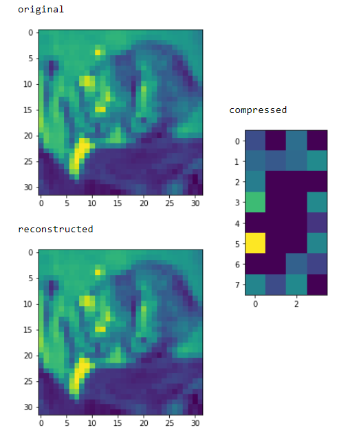

## Autoencoders on CIFAR and MNIST
Yes, N. Nets are used for Supervised Learning - we give them data and labels - they adjust weights to predict - But using autoencoders generate data and apply unsupervised learning to it - KMeans Clustering as applied here to make clusters of MNIST digits

## Motivation
Using the Autoencoders and their power to generalize the images, convert the image into compressed form is very exciting. It enables numerous possibilites of saving the data and processing the data at very low cost.

## Code style

[](https://github.com/feross/standard)
 
## Screenshots

Sample 1             |  Sample 2
:-------------------------:|:-------------------------:
 | 

## Build status
The model architecture is ready to be used for development and deployment weights are released.

MNIST and CIFAR10 dataset was used to reduce the computation time and check the results.

http://www.cs.toronto.edu/~kriz/cifar.html

http://yann.lecun.com/exdb/mnist/


## Trained for 3 epoch
---
## Tech/framework used
<b>Built with</b>
- Tensorflow 2.3.1
- Keras
- Numpy

## Features
The visualization of the layers allow us to find what is present in compressed version and what is the difference in original and reconstructed version of the image

## Code Example

This is done faster using Numpy.

```python
# Creating the AutoEncoder Model - input and output same
# for MNIST
# 784 for 1 channel MNIST dataset of digits
model = Sequential()
model.add(Dense(128, activation='relu', input_shape=(784,)))
model.add(Dense( 32, activation='relu')) # symmetric centroid
model.add(Dense(128, activation='relu'))
model.add(Dense(784, activation='sigmoid'))

# for CIFAR10
# 1024 for 1 channel and 3072 for 3 channels
# input equal to output - and internal hidden layers can be the same
model = Sequential()
model.add(Dense(128, activation='relu', input_shape=(1024,) ))
model.add(Dense( 32, activation='relu'))
model.add(Dense(128, activation='relu'))
model.add(Dense(1024, activation='sigmoid'))
```

## Installation
- Install the requirements `pip install -r requirements.txt`
- Train the model or Download pretrained weights
- Run the evaluation on the image data by passing the path

## How to use?
- Download dataset and clean it - using `CIFAR_autoencoder.ipynb` or `MNIST_autoencoder.ipynb` notebook
- Train the model which you are willing to use
- Evaluation script of the same model is there to infer your models

## Contribute
You can for the repository - create a pull request after making changes or can drop the issue by creating a new issue. It would be helpful for the community.

### Last Updated on 4 Feb 2021   
